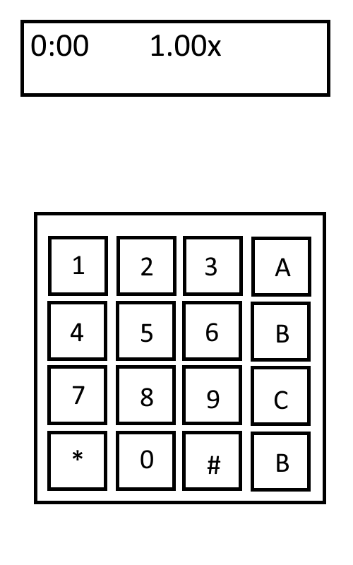
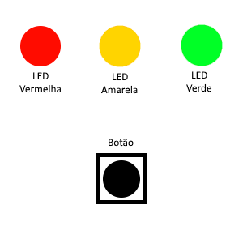

# Guia de desarme de bomba
Olá, se você está lendo este manual, você achou uma bomba(?).
Este guia irá como a bomba mostra a sua senha, que será a chave para seu sucesso!

## Conhecendo o hardware
Ela consiste em um visor e um teclado 4x4.

* Visor:
    * Tempo restante.
    * Multiplicador do tempo.
    * Senha digitada (2° linha).
* Teclado 4x4:
    * Os numeros são utilizados para a senha.
    * "*" é para apagar o ultimo digito da senha insirida.
    * "#" é para confirmar a senha inserida.
    * As letras não fazem nada.

* Tem 3 LEDs que serão utilizadas para revelar a senha.
* O botão tambem é utilizado para revelar a senha.

## Obtendo a senha
Para obtela deverá prestar atenção nas instruções.

1° Digito.

* Caso você apertar o botão e a primeira linha não mudar para caracteres differentes, a LED vermelha ira piscar quando o ultimo digito dos segundos for o primeiro digito.
* Caso quando pressionar o botão e ir para caracteres differentes, utilize a tabela para transformalos em numeros.
    * Se o primeiro caracter for um coração a formula é `f(x) = x / (10*2)`
    * Caso for outro a formula é `f(x) = x /(10*0.5)`

2° Digito

* Segurando o botão e quando a led verde piscar ou um caracter diferente aparecer na segunda linha significa o ultimo caracter do segudo é uma parte da senha.
    * Se no multiplicador to timer for `0.00x` (lembrando que 0.00 é um exemplo) for `x`.

| N° do senha | N° da segundo |
|------|-------|
| 0 | 0 |
| 1 | 3 | 
| 2 | 6 | 
| 3 | 9 |
| 4 | 2 |
| 5 | 5 |
| 6 | 8 |
| 7 | 1 |
| 8 | 4 |
| 9 | 7 | 

* Se no multiplicador to timer for `0.00y` (lembrando que 0.00 é um exemplo) for `y`.

| N° do senha | N° da segundo |
|------|-------|
| 0 | 0 |
| 1 | 7 | 
| 2 | 4 | 
| 3 | 1 |
| 4 | 8 |
| 5 | 5 |
| 6 | 2 |
| 7 | 9 |
| 8 | 6 |
| 9 | 3 | 

3° Digito
* Para obter o valor o digito após `0.00x --` sendo -- dois digitos, o primeiro é y, o segundo é k, assim para `f−1(y) = (y−k) mod 10`

5° Digito
* Quando não tem
* Se amarelo estiver ligado a maioria do tempo e desligar em certo segunado este é X, se segurar o botão e a LED amarela ligar este é Y.
Dada a fórmula que transforma um dígito \( d \in \{0, \dots, 9\} \) em dois dígitos \( x, y \in \{0, \dots, 9\} \):

\[
x = (d + a) \bmod 10
\]
\[
y = (b \times d + c) \bmod 10
\]

onde \( a, b, c \in \{0, \dots, 9\} \) são constantes escolhidas, com a condição de que \( b \) seja invertível módulo 10 (ou seja, \( b \in \{1, 3, 7, 9\} \)).

---

### Passos para Recuperar \( d \) a partir de \( x \) e \( y \):

1. **Isolar \( d \) usando \( x \):**

\[
d_x = (x - a) \bmod 10
\]

2. **Verificar se o valor encontrado confere com \( y \):**

\[
y \stackrel{?}{=} (b \times d_x + c) \bmod 10
\]

- Se for verdadeiro, então:

\[
d = d_x
\]

- Caso contrário, o par \((x, y)\) não corresponde a um valor válido de \( d \) com as constantes escolhidas.

---

### Exemplo Prático

Se escolhermos:

- \( a = 4 \)
- \( b = 7 \) (que é invertível módulo 10)
- \( c = 2 \)

E recebemos \( x = 9 \) e \( y = 7 \):

1. Calculamos:

\[
d_x = (9 - 4) \bmod 10 = 5
\]

2. Verificamos:

\[
(7 \times 5 + 2) \bmod 10 = (35 + 2) \bmod 10 = 37 \bmod 10 = 7
\]

Como confere com \( y \), concluímos que:

\[
d = 5
\]

---

### Observações

- É fundamental que \( b \) tenha inverso módulo 10 para garantir que a fórmula seja reversível.
- A operação de módulo 10 garante que todos os valores fiquem dentro do intervalo \(0\) a \(9\).
